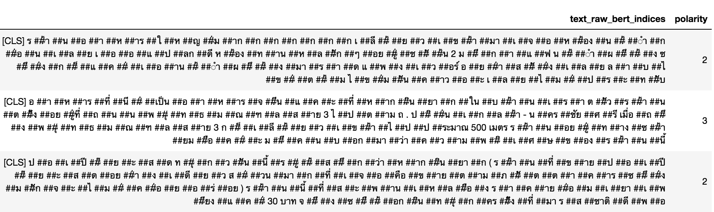
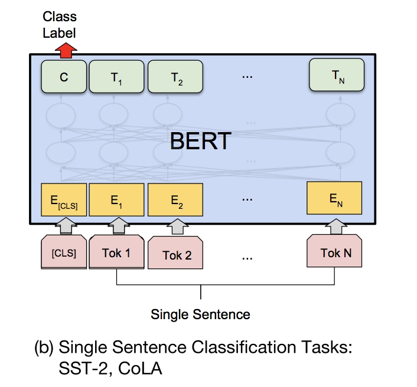

# food_review_analysis
Quick prototype of food review analysis using machine learning

# Probelm Description

The problem is given a text review in Thai, to clasify this review into 5 differet claases. 
So, obviously it's a text multl-class classifcation task.

# Methods

Because we don't have enough Thai corpus to train on our own language model, we use
pre-trained language model, **bert-base-multilingual-cased**, which is realesed by Google and 
it support 104 languages including Thai.

It will make our tokenization result makes more sense, see blow screenshot as an example.


Then, as followed the **BERT Paper** suggested how to fine-tune single sentence classification.
The architecture looks like the below:



Fpr more details, please see **data_process.py, train.py and model/bert_ssc.py**.

# Result
Due to lacking of GPU resoruces, the fine-tuning model only stopped and 2 epochs.., the validating
accuracy and f1-score could refer to **bert_ssc-restaurant-191219-0740.log**
# Usage

Please run the below command line in order.
And the submisison will put under result directory.

### Requirements:

* python 3.6.5+ environment

```sh
pip3 install -r requirements.txt
```


### Data Processing

```sh
python data_process.py
```

### Training

```sh
make train
```
## Testing

```sh
python infer.py
```


